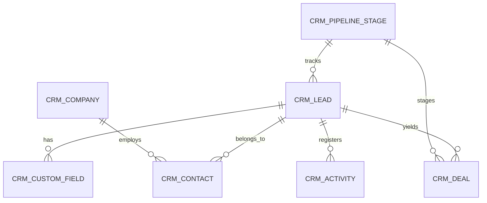

# CRM Pro - Backend Service

This is the complete, production-ready backend for LeadsCRM built on the **Frappe Framework** and backed by a **PostgreSQL** database.

---

## Features

1. **Lead & Deal Lifecycle:** Full CRM DocTypes for managing leads, deals, organizations (companies), and unified multi-channel contacts (multi-phone, multi-email support).
2. **Pipelines & Stage Configurations:** Fully customisable Kanban board pipelines and stages matching the Ocean Glass visual designs.
3. **Whitelisted REST APIs:** Production endpoints for CRUD operations, search, filters, team assignment, dashboard aggregation, and reports.
4. **Queue Workers & Automation:** Process reminders, log audit trails, dispatch notifications, and schedule daily backups and metric aggregations.
5. **AI Module Hooks:** Automated lead quality scoring, personalized introduction email drafting, and opportunity closing probability predictions.
6. **Containerized Stack:** Nginx, Gunicorn backend, PostgreSQL database, and Redis (cache & queue workers) in a unified environment.

---

## Installation & Setup

### Prerequisites
* [Frappe Bench v14+](https://github.com/frappe/bench) installed on a Linux/WSL environment.
* PostgreSQL database instance.

### Step 1: Clone and link the app to your bench
Copy the `crm_pro` directory to your bench `apps` folder:
```bash
# Go to your bench workspace
cd ~/frappe-bench

# Place crm_pro in the apps folder and install dependencies
bench get-app --local apps/crm_pro
```

### Step 2: Install the app on your site
Install the app onto your target bench site:
```bash
bench --site crm.local install-app crm_pro
```
*Note: The installation triggers the `after_install` seed hook in `crm_pro/crm_pro/install.py` which automatically seeds default stages, order IDs, colors, general sales teams, and settings.*

### Step 3: Run the server and background workers
```bash
# Start Bench
bench start
```

---

## REST API Reference

All methods are whitelisted and accessed using standard Frappe session credentials or JWT/API Tokens.

### 1. Lead CRUD Operations

#### Create Lead
* **Endpoint:** `/api/method/crm_pro.crm_pro.api.create_lead`
* **Method:** `POST`
* **Arguments:**
  * `lead_name` (String, Required)
  * `email` (String)
  * `mobile` (String)
  * `stage` (String, Stage link name)
  * `source` (String)
  * `user` (String, Owner ID)

#### Update Lead
* **Endpoint:** `/api/method/crm_pro.crm_pro.api.update_lead`
* **Method:** `POST`
* **Arguments:**
  * `name` (String, Required Lead ID)
  * `stage` (String)
  * `opportunity_value` (Decimal)

#### Delete Lead
* **Endpoint:** `/api/method/crm_pro.crm_pro.api.delete_lead`
* **Method:** `POST`
* **Arguments:**
  * `name` (String, Required Lead ID)

---

## Database Architecture (PostgreSQL)

The entity relationships are structured as:


