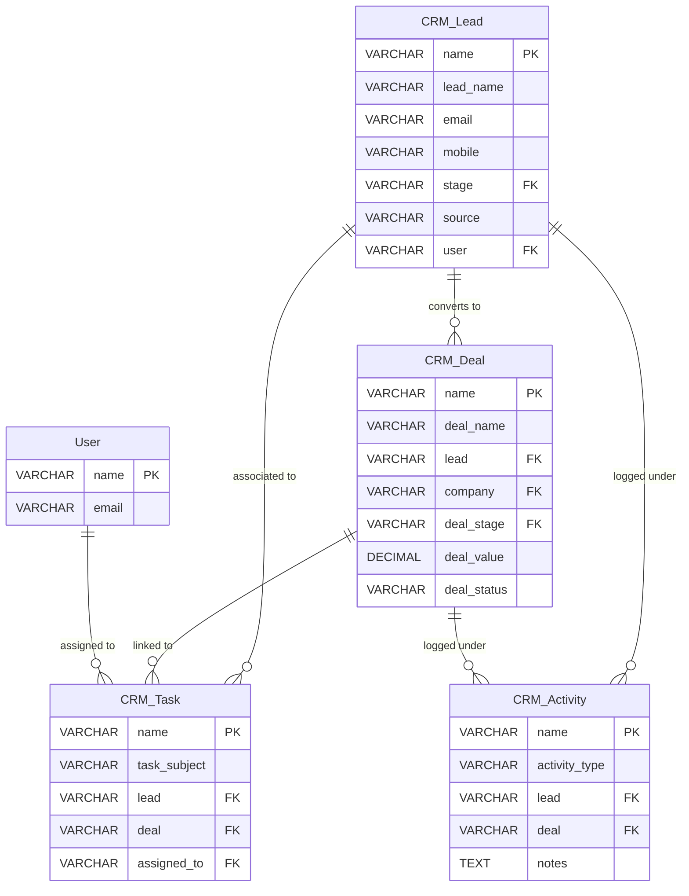
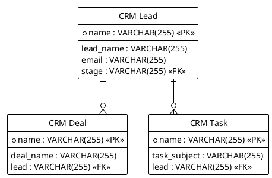

# CRM Pro Relational Entity Relationship Diagram

## 1. Executive Summary
This document presents the relational structure and data flows of the CRM Pro system.

## 2. Mermaid ER Diagram

## 3. PlantUML ER Diagram

## 4. Parent-child relationships
* Parent Table `tabCRM Contact` holds children in `tabCRM Contact Email`
* Parent Table `tabCRM Contact` holds children in `tabCRM Contact Phone`
* Parent Table `tabCRM Lead` holds children in `tabCRM Custom Field`

## 5. Link-field relationships
* Field `company` in `tabCRM Contact` links to parent table `tabCRM Company`
* Field `company` in `tabCRM Deal` links to parent table `tabCRM Company`
* Field `deal` in `tabCRM Activity` links to parent table `tabCRM Deal`
* Field `deal` in `tabCRM Attachment` links to parent table `tabCRM Deal`
* Field `deal` in `tabCRM Note` links to parent table `tabCRM Deal`
* Field `deal` in `tabCRM Task` links to parent table `tabCRM Deal`
* Field `lead` in `tabCRM Activity` links to parent table `tabCRM Lead`
* Field `lead` in `tabCRM Attachment` links to parent table `tabCRM Lead`
* Field `lead` in `tabCRM Call Log` links to parent table `tabCRM Lead`
* Field `lead` in `tabCRM Contact` links to parent table `tabCRM Lead`
* Field `lead` in `tabCRM Deal` links to parent table `tabCRM Lead`
* Field `lead` in `tabCRM Email Log` links to parent table `tabCRM Lead`
* Field `lead` in `tabCRM Meeting` links to parent table `tabCRM Lead`
* Field `lead` in `tabCRM Note` links to parent table `tabCRM Lead`
* Field `lead` in `tabCRM Reminder` links to parent table `tabCRM Lead`
* Field `lead` in `tabCRM Task` links to parent table `tabCRM Lead`
* Field `lead` in `tabCRM WhatsApp Log` links to parent table `tabCRM Lead`
* Field `pipeline` in `tabCRM Pipeline Stage` links to parent table `tabCRM Pipeline`
* Field `default_pipeline` in `tabCRM Settings` links to parent table `tabCRM Pipeline`
* Field `deal_stage` in `tabCRM Deal` links to parent table `tabCRM Pipeline Stage`
* Field `stage` in `tabCRM Lead` links to parent table `tabCRM Pipeline Stage`
* Field `team` in `tabCRM Sales Target` links to parent table `tabCRM Team`
* Field `team` in `tabCRM User Profile` links to parent table `tabCRM Team`
* Field `campaign` in `tabfacebook_lead` links to parent table `tabCampaign`
* Field `company` in `tabactivity` links to parent table `tabCompany`
* Field `company` in `tabcampaign` links to parent table `tabCompany`
* Field `company` in `tabcompany` links to parent table `tabCompany`
* Field `company` in `tabcontact` links to parent table `tabCompany`
* Field `company` in `tabdeal` links to parent table `tabCompany`
* Field `company` in `tabdepartment` links to parent table `tabCompany`
* Field `company` in `tabfacebook_lead` links to parent table `tabCompany`
* Field `company` in `tabfollowup` links to parent table `tabCompany`
* Field `company` in `tabinvoice` links to parent table `tabCompany`
* Field `company` in `tablead_source` links to parent table `tabCompany`
* Field `company` in `tabopportunity` links to parent table `tabCompany`
* Field `company` in `tabpayment_entry` links to parent table `tabCompany`
* Field `company` in `tabprice_list` links to parent table `tabCompany`
* Field `company` in `tabproduct` links to parent table `tabCompany`
* Field `company` in `tabproduct_category` links to parent table `tabCompany`
* Field `company` in `tabquotation` links to parent table `tabCompany`
* Field `company` in `tabtask` links to parent table `tabCompany`
* Field `company` in `tabteam` links to parent table `tabCompany`
* Field `company` in `tabterritory` links to parent table `tabCompany`
* Field `company` in `tabwhatsapp_conversation` links to parent table `tabCompany`
* Field `company` in `tabwhatsapp_message` links to parent table `tabCompany`
* Field `customer` in `tabinvoice` links to parent table `tabContact`
* Field `customer` in `tabquotation` links to parent table `tabContact`
* Field `invoice` in `tabpayment_entry` links to parent table `tabInvoice`
* Field `lead` in `tabactivity` links to parent table `tabLead`
* Field `associated_lead` in `tabcontact` links to parent table `tabLead`
* Field `lead` in `tabfollowup` links to parent table `tabLead`
* Field `lead` in `tabopportunity` links to parent table `tabLead`
* Field `related_lead` in `tabtask` links to parent table `tabLead`
* Field `lead` in `tabwhatsapp_conversation` links to parent table `tabLead`
* Field `opportunity` in `tabdeal` links to parent table `tabOpportunity`
* Field `product` in `tabprice_list` links to parent table `tabProduct`
* Field `product_category` in `tabproduct` links to parent table `tabProduct Category`
* Field `allowed_role` in `tabworkflow_action` links to parent table `tabRole`
* Field `team` in `tabactivity` links to parent table `tabTeam`
* Field `team` in `tabcampaign` links to parent table `tabTeam`
* Field `team` in `tabcompany` links to parent table `tabTeam`
* Field `team` in `tabdeal` links to parent table `tabTeam`
* Field `team` in `tabfacebook_lead` links to parent table `tabTeam`
* Field `team` in `tabfollowup` links to parent table `tabTeam`
* Field `team` in `tabinvoice` links to parent table `tabTeam`
* Field `team` in `tablead_source` links to parent table `tabTeam`
* Field `team` in `tabopportunity` links to parent table `tabTeam`
* Field `team` in `tabpayment_entry` links to parent table `tabTeam`
* Field `team` in `tabprice_list` links to parent table `tabTeam`
* Field `team` in `tabproduct` links to parent table `tabTeam`
* Field `team` in `tabproduct_category` links to parent table `tabTeam`
* Field `team` in `tabquotation` links to parent table `tabTeam`
* Field `team` in `tabtask` links to parent table `tabTeam`
* Field `team` in `tabwhatsapp_conversation` links to parent table `tabTeam`
* Field `team` in `tabwhatsapp_message` links to parent table `tabTeam`
* Field `territory` in `tabactivity` links to parent table `tabTerritory`
* Field `territory` in `tabcampaign` links to parent table `tabTerritory`
* Field `territory` in `tabcompany` links to parent table `tabTerritory`
* Field `territory` in `tabdeal` links to parent table `tabTerritory`
* Field `territory` in `tabfacebook_lead` links to parent table `tabTerritory`
* Field `territory` in `tabfollowup` links to parent table `tabTerritory`
* Field `territory` in `tabinvoice` links to parent table `tabTerritory`
* Field `territory` in `tablead_source` links to parent table `tabTerritory`
* Field `territory` in `tabopportunity` links to parent table `tabTerritory`
* Field `territory` in `tabpayment_entry` links to parent table `tabTerritory`
* Field `territory` in `tabprice_list` links to parent table `tabTerritory`
* Field `territory` in `tabproduct` links to parent table `tabTerritory`
* Field `territory` in `tabproduct_category` links to parent table `tabTerritory`
* Field `territory` in `tabquotation` links to parent table `tabTerritory`
* Field `territory` in `tabtask` links to parent table `tabTerritory`
* Field `territory` in `tabwhatsapp_conversation` links to parent table `tabTerritory`
* Field `territory` in `tabwhatsapp_message` links to parent table `tabTerritory`
* Field `user` in `tabCRM Audit Log` links to parent table `tabUser`
* Field `user` in `tabCRM Lead` links to parent table `tabUser`
* Field `added_by` in `tabCRM Note` links to parent table `tabUser`
* Field `for_user` in `tabCRM Notification` links to parent table `tabUser`
* Field `recipient` in `tabCRM Reminder` links to parent table `tabUser`
* Field `user` in `tabCRM Sales Target` links to parent table `tabUser`
* Field `assigned_to` in `tabCRM Task` links to parent table `tabUser`
* Field `lead_user` in `tabCRM Team` links to parent table `tabUser`
* Field `user` in `tabCRM User Profile` links to parent table `tabUser`
* Field `assigned_to` in `tabactivity` links to parent table `tabUser`
* Field `created_by` in `tabactivity` links to parent table `tabUser`
* Field `modified_by` in `tabactivity` links to parent table `tabUser`
* Field `owner` in `tabactivity` links to parent table `tabUser`
* Field `performed_by` in `tabactivity` links to parent table `tabUser`
* Field `assigned_to` in `tabapi_log` links to parent table `tabUser`
* Field `created_by` in `tabapi_log` links to parent table `tabUser`
* Field `modified_by` in `tabapi_log` links to parent table `tabUser`
* Field `owner` in `tabapi_log` links to parent table `tabUser`
* Field `user` in `tabapi_log` links to parent table `tabUser`
* Field `assigned_to` in `tabaudit_log` links to parent table `tabUser`
* Field `created_by` in `tabaudit_log` links to parent table `tabUser`
* Field `modified_by` in `tabaudit_log` links to parent table `tabUser`
* Field `owner` in `tabaudit_log` links to parent table `tabUser`
* Field `user` in `tabaudit_log` links to parent table `tabUser`
* Field `assigned_to` in `tabautomation_rule` links to parent table `tabUser`
* Field `created_by` in `tabautomation_rule` links to parent table `tabUser`
* Field `modified_by` in `tabautomation_rule` links to parent table `tabUser`
* Field `owner` in `tabautomation_rule` links to parent table `tabUser`
* Field `assigned_to` in `tabcampaign` links to parent table `tabUser`
* Field `created_by` in `tabcampaign` links to parent table `tabUser`
* Field `modified_by` in `tabcampaign` links to parent table `tabUser`
* Field `owner` in `tabcampaign` links to parent table `tabUser`
* Field `account_manager` in `tabcompany` links to parent table `tabUser`
* Field `assigned_to` in `tabcompany` links to parent table `tabUser`
* Field `created_by` in `tabcompany` links to parent table `tabUser`
* Field `modified_by` in `tabcompany` links to parent table `tabUser`
* Field `owner` in `tabcompany` links to parent table `tabUser`
* Field `assigned_to` in `tabdeal` links to parent table `tabUser`
* Field `created_by` in `tabdeal` links to parent table `tabUser`
* Field `modified_by` in `tabdeal` links to parent table `tabUser`
* Field `owner` in `tabdeal` links to parent table `tabUser`
* Field `assigned_to` in `tabdepartment` links to parent table `tabUser`
* Field `created_by` in `tabdepartment` links to parent table `tabUser`
* Field `modified_by` in `tabdepartment` links to parent table `tabUser`
* Field `owner` in `tabdepartment` links to parent table `tabUser`
* Field `assigned_to` in `tabexport_job` links to parent table `tabUser`
* Field `created_by` in `tabexport_job` links to parent table `tabUser`
* Field `modified_by` in `tabexport_job` links to parent table `tabUser`
* Field `owner` in `tabexport_job` links to parent table `tabUser`
* Field `assigned_to` in `tabfacebook_lead` links to parent table `tabUser`
* Field `created_by` in `tabfacebook_lead` links to parent table `tabUser`
* Field `modified_by` in `tabfacebook_lead` links to parent table `tabUser`
* Field `owner` in `tabfacebook_lead` links to parent table `tabUser`
* Field `assigned_to` in `tabfollowup` links to parent table `tabUser`
* Field `created_by` in `tabfollowup` links to parent table `tabUser`
* Field `modified_by` in `tabfollowup` links to parent table `tabUser`
* Field `owner` in `tabfollowup` links to parent table `tabUser`
* Field `assigned_to` in `tabimport_job` links to parent table `tabUser`
* Field `created_by` in `tabimport_job` links to parent table `tabUser`
* Field `modified_by` in `tabimport_job` links to parent table `tabUser`
* Field `owner` in `tabimport_job` links to parent table `tabUser`
* Field `assigned_to` in `tabinvoice` links to parent table `tabUser`
* Field `created_by` in `tabinvoice` links to parent table `tabUser`
* Field `modified_by` in `tabinvoice` links to parent table `tabUser`
* Field `owner` in `tabinvoice` links to parent table `tabUser`
* Field `assigned_to` in `tablead` links to parent table `tabUser`
* Field `assigned_to` in `tablead_source` links to parent table `tabUser`
* Field `created_by` in `tablead_source` links to parent table `tabUser`
* Field `modified_by` in `tablead_source` links to parent table `tabUser`
* Field `owner` in `tablead_source` links to parent table `tabUser`
* Field `assigned_to` in `tabnotification` links to parent table `tabUser`
* Field `created_by` in `tabnotification` links to parent table `tabUser`
* Field `for_user` in `tabnotification` links to parent table `tabUser`
* Field `modified_by` in `tabnotification` links to parent table `tabUser`
* Field `owner` in `tabnotification` links to parent table `tabUser`
* Field `assigned_to` in `tabopportunity` links to parent table `tabUser`
* Field `created_by` in `tabopportunity` links to parent table `tabUser`
* Field `modified_by` in `tabopportunity` links to parent table `tabUser`
* Field `owner` in `tabopportunity` links to parent table `tabUser`
* Field `assigned_to` in `tabpayment_entry` links to parent table `tabUser`
* Field `created_by` in `tabpayment_entry` links to parent table `tabUser`
* Field `modified_by` in `tabpayment_entry` links to parent table `tabUser`
* Field `owner` in `tabpayment_entry` links to parent table `tabUser`
* Field `assigned_to` in `tabprice_list` links to parent table `tabUser`
* Field `created_by` in `tabprice_list` links to parent table `tabUser`
* Field `modified_by` in `tabprice_list` links to parent table `tabUser`
* Field `owner` in `tabprice_list` links to parent table `tabUser`
* Field `assigned_to` in `tabproduct` links to parent table `tabUser`
* Field `created_by` in `tabproduct` links to parent table `tabUser`
* Field `modified_by` in `tabproduct` links to parent table `tabUser`
* Field `owner` in `tabproduct` links to parent table `tabUser`
* Field `assigned_to` in `tabproduct_category` links to parent table `tabUser`
* Field `created_by` in `tabproduct_category` links to parent table `tabUser`
* Field `modified_by` in `tabproduct_category` links to parent table `tabUser`
* Field `owner` in `tabproduct_category` links to parent table `tabUser`
* Field `assigned_to` in `tabquotation` links to parent table `tabUser`
* Field `created_by` in `tabquotation` links to parent table `tabUser`
* Field `modified_by` in `tabquotation` links to parent table `tabUser`
* Field `owner` in `tabquotation` links to parent table `tabUser`
* Field `assigned_to` in `tabtask` links to parent table `tabUser`
* Field `assignee` in `tabtask` links to parent table `tabUser`
* Field `created_by` in `tabtask` links to parent table `tabUser`
* Field `modified_by` in `tabtask` links to parent table `tabUser`
* Field `owner` in `tabtask` links to parent table `tabUser`
* Field `assigned_to` in `tabteam` links to parent table `tabUser`
* Field `created_by` in `tabteam` links to parent table `tabUser`
* Field `leader` in `tabteam` links to parent table `tabUser`
* Field `modified_by` in `tabteam` links to parent table `tabUser`
* Field `owner` in `tabteam` links to parent table `tabUser`
* Field `assigned_to` in `tabterritory` links to parent table `tabUser`
* Field `created_by` in `tabterritory` links to parent table `tabUser`
* Field `modified_by` in `tabterritory` links to parent table `tabUser`
* Field `owner` in `tabterritory` links to parent table `tabUser`
* Field `assigned_to` in `tabwebhook_log` links to parent table `tabUser`
* Field `created_by` in `tabwebhook_log` links to parent table `tabUser`
* Field `modified_by` in `tabwebhook_log` links to parent table `tabUser`
* Field `owner` in `tabwebhook_log` links to parent table `tabUser`
* Field `assigned_to` in `tabwhatsapp_conversation` links to parent table `tabUser`
* Field `created_by` in `tabwhatsapp_conversation` links to parent table `tabUser`
* Field `modified_by` in `tabwhatsapp_conversation` links to parent table `tabUser`
* Field `owner` in `tabwhatsapp_conversation` links to parent table `tabUser`
* Field `assigned_to` in `tabwhatsapp_message` links to parent table `tabUser`
* Field `created_by` in `tabwhatsapp_message` links to parent table `tabUser`
* Field `modified_by` in `tabwhatsapp_message` links to parent table `tabUser`
* Field `owner` in `tabwhatsapp_message` links to parent table `tabUser`
* Field `assigned_to` in `tabworkflow_action` links to parent table `tabUser`
* Field `created_by` in `tabworkflow_action` links to parent table `tabUser`
* Field `modified_by` in `tabworkflow_action` links to parent table `tabUser`
* Field `owner` in `tabworkflow_action` links to parent table `tabUser`
* Field `conversation` in `tabwhatsapp_message` links to parent table `tabWhatsApp Conversation`
